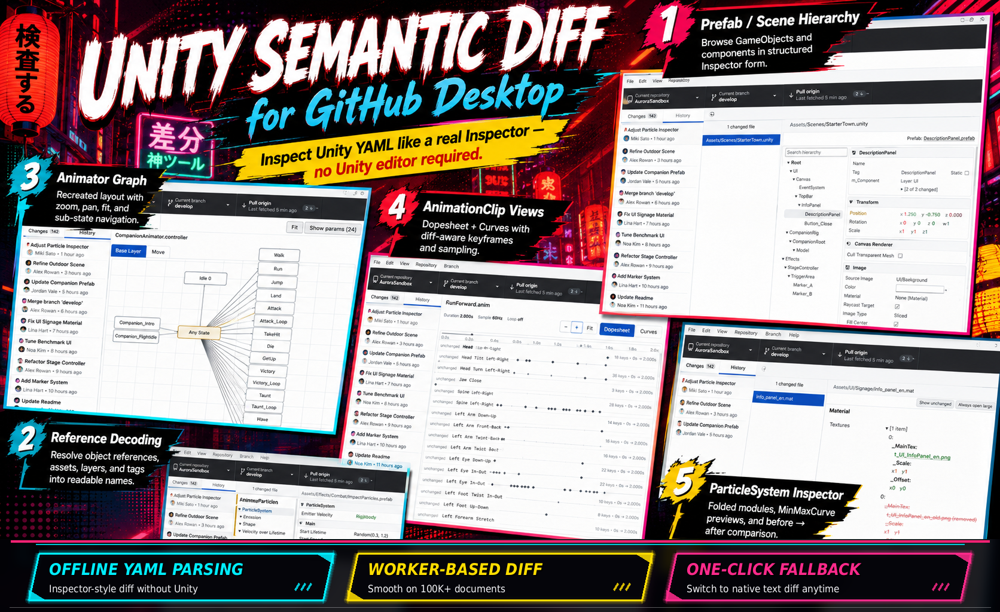

# GitHub Desktop for Unity



A GitHub Desktop fork that makes Unity source control readable. Scene, prefab, material, controller, and animation diffs render the way the Unity Inspector does — without opening Unity, without a project import step, straight off the git-tracked YAML.

Only the diff renderer is new. The commit view, push / pull, branch UI, history, GitHub integration and every other part of Desktop are untouched upstream code, so nothing you already rely on has moved or changed.

## Supported formats

Every Unity YAML asset extension is picked up when the repository looks like a Unity project:

- `.unity` — scenes
- `.prefab` — prefabs (nested instances expanded inline, overrides baked in)
- `.mat` — materials
- `.controller` — AnimatorControllers (graph view)
- `.anim` — AnimationClips (dopesheet + curves)
- `.asset` — ScriptableObjects and everything else Unity serialises as YAML

The five headline formats above have hand-tuned inspectors that match Unity's own layout. Anything else — custom ScriptableObjects, LightingSettings, SpriteAtlas, PhysicMaterial, VRC blueprints, whatever — falls back to a generic property-tree inspector. Same GameObject / component structure, references still decoded to names, layers and tags still resolved to real strings, values still colored by add / remove / modify / unchanged. Never a raw YAML wall unless you ask for one.

And you *can* ask for one. The diff toolbar has a **Unity Diff** toggle that flips instantly back to the original text diff, whenever you want to see the underlying YAML — it lives in the standard Diff Options menu next to whitespace and hidden-whitespace.

## What each inspector does

**Prefab / Scene Hierarchy.** GameObject tree with per-component layouts (Transform, RectTransform, colliders, MeshRenderer, Rigidbody, Materials, …). Prefab instances are expanded inline; overrides are baked into the diff, so removing an override shows up as `override → source default`, not a dangling row you have to re-apply in your head.

**Reference decoding.** `{fileID: -1000, guid: abc}` becomes `Player (Transform)` or `Metal_Rough.mat`. `m_Layer: 8` becomes `Terrain`. Same for tags.

**AnimatorController graph.** The same layout you'd see in the Animator window, drawn straight from the `m_Position` coordinates Unity saves in the YAML. Pan, zoom, fit, double-click to drill into sub state machines. Nodes and edges outside the viewport are culled, so a 100-state controller stays interactive.

**AnimationClip views.** Dopesheet or curves, keyframes colored by add / remove / modify / unchanged. Ctrl-scroll to zoom, Shift-scroll to pan, click a keyframe to copy `(path, attribute, time, value)`. A shared playhead samples every curve at once.

**ParticleSystem inspector.** The ~25 modules Unity groups by hand (Initial, Shape, Emission, Color over Lifetime, Trail, Noise, …) render as collapsible sections. `MinMaxCurve` and `MinMaxGradient` values get an inline sparkline or color strip, shown as `before → after` when they change.

**Model / FBX fileID resolution.** Prefabs and scenes often reference objects *inside* imported `.fbx` files, and Unity generates those fileIDs by hashing the object's hierarchy path plus class name (xxHash64). The fork reads the FBX directly with [`fbx-parser`](https://github.com/picode7/fbx-parser) — just the Model tree, no geometry — and re-derives the same ids with [`xxhashjs`](https://github.com/pierrec/js-xxhash). The algorithm was cross-checked against [V-Sekai's `unidot_importer`](https://github.com/V-Sekai/unidot_importer), whose Godot port relies on it for `.unitypackage` conversion. Both deps are pure JS, so the Electron packaging story is unchanged.

**Off the main thread.** YAML parsing, prefab expansion, and the diff run in a worker. The eager diff carries only the changed documents; other documents stream in over a separate IPC channel when you click a node. 100k-document scenes stay responsive.

## Coexisting with upstream

The fork installs alongside official GitHub Desktop and shiftkey's `github-desktop-bin` — distinct bundle IDs, distinct install paths, its own `x-github-desktop-u://` URL scheme, its own GitHub OAuth app. Signing into one doesn't break signing into the other. The product name is suffixed with `U` (`GitHub Desktop U`, `desktop-u`) so nothing collides on disk or in the app registrations.

## Install

- **Windows** — grab the `GitHubDesktopUSetup-x64.exe` asset from the latest [`-u` release on the Releases page](https://github.com/Citrus-XR/github-desktop-unity3d/releases). Fork builds carry an extra `-u<N>` suffix on the tag (e.g. `release-3.6.3-beta3-u1`); the plain upstream tags never contain `-u`, so filtering by that is the shortcut. Builds aren't code-signed, so Windows SmartScreen will complain; **More info → Run anyway**.
- **Linux (Arch)** — see [`linux/README.md`](linux/README.md). Short form: `cd linux/aur/desktop-u && makepkg -si`. The PKGBUILD tracks `origin/development`, so re-running `makepkg -si` picks up new commits without editing anything.

macOS isn't currently packaged — the fork doesn't have Apple Developer signing keys to produce a shippable `.app`, and the CI job that would build one is disabled.

## Where the code lives

```
app/src/lib/unity/           parsing, prefab expansion, diff pipeline
app/src/models/unity/        plain-data types + Unity 2022.3 class-id table
app/src/main-process/unity/  worker + inspection service (IPC boundary)
app/src/ui/diff/unity/       React components (inspector, animator graph,
                             animation clip views, particle-system widgets)
script/unity-diff-stress.ts  stress harness — replays the pipeline across
                             every commit of a target repo
```

Tests live under `app/test/unit/unity/` and run in the normal `yarn test:unit` pass.

## Contributors

The Unity Semantic Diff feature — parser, worker, every inspector, the FBX fileID resolver, the diff pipeline — was written in collaboration with [Claude](https://claude.com/claude) (Anthropic). Direction, requirements, code review and integration by the fork's maintainers.
